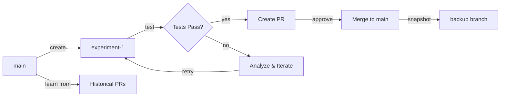

# GitHub Branch Management Strategy for ZacAi Self-Learning

## Overview

This document defines the branch management strategy for ZacAi's autonomous self-learning, self-evolution, and self-healing capabilities. The strategy leverages GitHub as a version control system and memory store for ZacAi's code evolution.

## Branch Architecture

### 1. Stable Branch (`main` / `production`)

**Purpose:** Production-ready, always-functional codebase

**Characteristics:**
- Contains only tested, approved code
- Used as reference point for self-healing
- Never receives direct commits from ZacAi
- All changes arrive via approved pull requests
- Protected branch with required reviews

**Use Cases:**
- Deployment to production
- Self-healing rollback reference
- Stable API for external integrations
- Baseline for performance comparisons

### 2. Experimental Branches (`zacai-experiment-*`)

**Purpose:** Testing ground for ZacAi-generated improvements

**Naming Convention:** `zacai-experiment-{feature-name}-{timestamp}`

**Examples:**
- `zacai-experiment-optimize-inference-20250105`
- `zacai-experiment-new-attention-mechanism-20250105`
- `zacai-experiment-memory-reduction-20250105`

**Characteristics:**
- Created automatically by ZacAi
- Contains experimental code changes
- May be unstable or incomplete
- Includes reasoning logs and diagnostics
- Automatically tested via CI/CD
- Can be merged to staging for evaluation

**Lifecycle:**
1. ZacAi identifies improvement opportunity
2. Creates experimental branch from `main`
3. Implements changes with reasoning documentation
4. Runs automated tests
5. Creates PR with detailed analysis
6. Human reviews and approves/rejects
7. Merged or archived based on outcome

### 3. Backup Branches (`zacai-backup-*`)

**Purpose:** Versioned snapshots for disaster recovery

**Naming Convention:** `zacai-backup-{version}-{timestamp}`

**Examples:**
- `zacai-backup-v0.0.5-20250105-1200`
- `zacai-backup-stable-20250105`

**Characteristics:**
- Automated periodic snapshots
- Created before major changes
- Immutable (no new commits)
- Retained per retention policy
- Used for rollback scenarios

**Schedule:**
- Daily: Keep last 7 days
- Weekly: Keep last 4 weeks
- Monthly: Keep last 12 months
- Major version: Keep indefinitely

### 4. Staging Branch (`staging`)

**Purpose:** Integration testing for experimental features

**Characteristics:**
- Receives merged experimental branches
- Runs comprehensive test suite
- May contain multiple experimental features
- Reset periodically to match `main`
- Used for human evaluation of AI changes

## Workflow Patterns

### Pattern 1: Self-Learning Feature Development

```
main (stable)
  │
  ├─→ zacai-experiment-feature-a
  │     ├─ Analyze codebase
  │     ├─ Generate improvement
  │     ├─ Run tests
  │     └─ Create PR with reasoning
  │
  └─→ zacai-experiment-feature-b
        └─ (parallel experiment)
```

### Pattern 2: Self-Healing Rollback

```
main (stable) ←─── Reference for "known good state"
  │
  ├─→ zacai-backup-before-change
  │     └─ Snapshot before risky operation
  │
  └─→ staging (with issues detected)
        └─ ZacAi detects problems
        └─ Initiates rollback to main
        └─ Creates diagnostic PR
```

### Pattern 3: Continuous Evolution



## ZacAi Automation Rules

### Auto-Commit Rules

ZacAi can auto-commit when:
- ✅ On experimental branches (full freedom)
- ✅ On staging branches (with tests)
- ❌ NEVER on main/production (requires PR)

### Auto-PR Creation

Trigger automatic PR creation when:
- Experimental branch passes all tests
- Changes meet quality thresholds
- Reasoning documentation is complete
- Diagnostic metrics show improvement

**PR Template:**
```markdown
## ZacAi Experimental Feature: {Name}

### Reasoning
{Natural language explanation}

### Changes Made
{File-by-file breakdown}

### Performance Impact
- Speed: {+/-}%
- Memory: {+/-}%
- Quality: {+/-}%

### Test Results
{Automated test summary}

### Rollback Plan
Reference commit: {sha}
```

### Auto-Merge Criteria

ZacAi can auto-merge to staging when:
- All tests pass (100%)
- No breaking changes detected
- Performance within acceptable range
- Human review not explicitly required

Human approval required for:
- Merging to main/production
- Breaking API changes
- Security-sensitive code
- Infrastructure modifications

## Branch Protection Rules

### Main Branch
- Require pull request reviews (1+)
- Require status checks to pass
- Require conversation resolution
- Restrict force pushes
- Restrict deletions

### Staging Branch
- Require status checks to pass
- Allow ZacAi bot to push
- Auto-reset weekly to match main

### Experimental Branches
- Minimal restrictions
- Allow ZacAi full access
- Automatic cleanup after 30 days

## GitHub App Permissions Required

- **Contents:** Read & Write (branch/file operations)
- **Pull Requests:** Read & Write (PR creation/management)
- **Issues:** Read & Write (diagnostic tracking)
- **Checks:** Read & Write (CI/CD integration)
- **Metadata:** Read (repository info)

## Self-Healing Integration

### Detection Phase
1. Monitor staging/production for errors
2. Analyze error patterns
3. Identify root cause
4. Determine if code-related

### Recovery Phase
1. Create backup snapshot (current state)
2. Checkout last known good commit (from main)
3. Create diagnostic branch
4. Implement fix with reasoning
5. Test fix thoroughly
6. Create emergency PR

### Learning Phase
1. Document what went wrong
2. Update prevention rules
3. Add tests to prevent recurrence
4. Store in knowledge base

## Metrics and Monitoring

Track for each experimental branch:
- **Success Rate:** % of experiments merged
- **Time to Merge:** Days from creation to merge
- **Performance Impact:** Speed/memory changes
- **Rollback Frequency:** How often rolled back
- **Human Intervention:** % requiring manual fixes

## Implementation Priorities

### Phase 1: Foundation (Current)
- ✅ Auto-populate GitHub credentials
- ⏳ Branch creation API
- ⏳ Commit with reasoning logs
- ⏳ PR creation automation

### Phase 2: Intelligence
- Basic experiment success prediction
- Automated test execution
- Diagnostic report generation
- Simple rollback mechanisms

### Phase 3: Autonomy
- Full self-learning loop
- Advanced self-healing
- Multi-experiment parallelization
- Intelligent merge strategies

## Best Practices

1. **Always Document Reasoning:** Every ZacAi commit includes why the change was made
2. **Test Before PR:** Never create PR without passing tests
3. **Snapshot Before Risk:** Create backup before any major change
4. **Learn from History:** Analyze past PRs to improve future experiments
5. **Human in the Loop:** Keep humans informed and empowered to intervene
6. **Gradual Rollout:** Test in staging before production
7. **Monitor Everything:** Track metrics for continuous improvement

## Security Considerations

- Experimental branches isolated from production
- Secrets never committed to any branch
- Code review required for main branch
- Audit trail for all ZacAi actions
- Rate limiting on branch creation
- Cleanup stale experimental branches

## Future Enhancements

- **Multi-model Experiments:** Test changes across different AI models
- **A/B Testing:** Deploy experimental features to subset of users
- **Automatic Rollback:** Detect issues and auto-rollback without human
- **Knowledge Graph:** Link experiments to learnings and outcomes
- **Collaborative Experiments:** Multiple ZacAi instances working together
